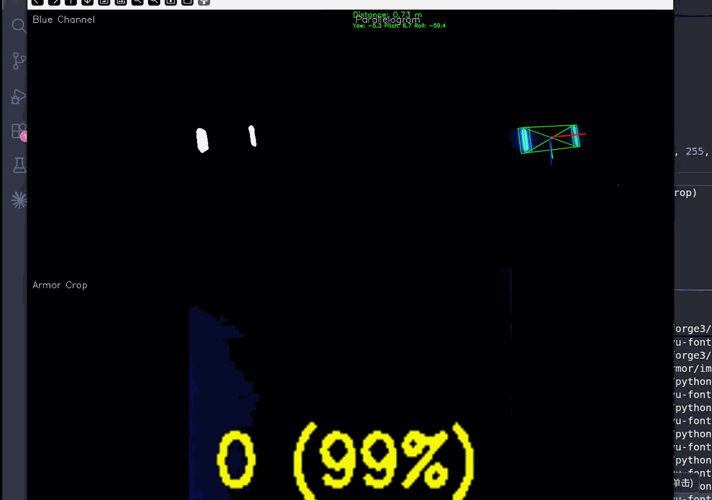
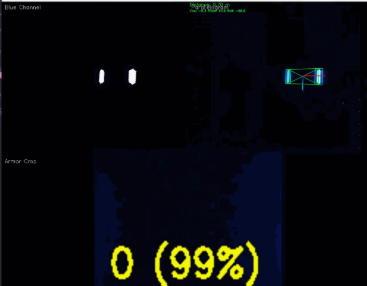
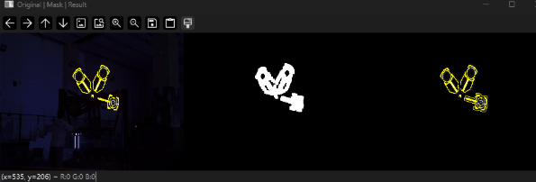

# RM_CV_task

RM 视觉组面试任务仓库，包含两个方向：前后端开发、CV

## 快速开始

```bash
git clone https://github.com/Linmoqian/RM_CV_task
cd RM_CV_task
conda env create -f environment.yml
conda activate rm-cv
```

## 目录结构

```
RM_CV_task/
├── UI_design/   # 前后端开发方向的设计原则和设计稿
└── CV_task/     # 视觉组考核题
```

## 效果速览

手写识别


**装甲板检测**





**能量机关**




## 开发环境

| 项目   | 说明                                              |
| ------ | ------------------------------------------------- |
| 语言   | Python 3.11                                       |
| 系统   | Windows 11 / Ubuntu 22.04 / macOS 23.04           |

## 说明

- 电控跳槽做视觉（求师兄手下留情）
- 可以的话，看看我的 GitHub 的其他项目吧（
- 代码大部分为 AI 生成，我负责进行删减和修改（你知道的，纯 AI 写的代码都是一坨大的）
- 相比于 C++，更喜欢 Python
